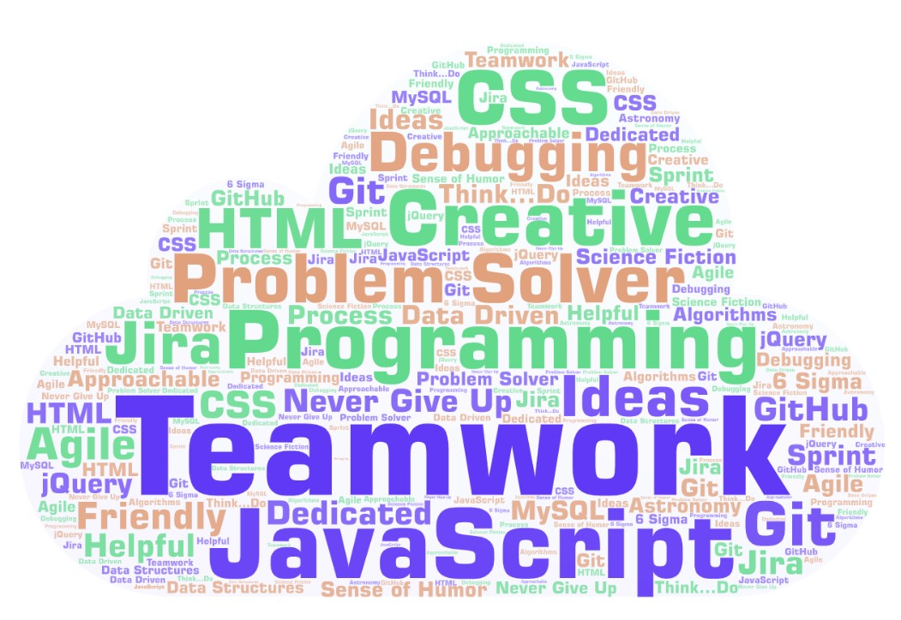

## Tell me about yourself:

### Over my career I've worked on lasers that carry data over the internet, released new products into manufacturing, worked on cutting edge Li-ion batteries for Formula 1 champion Lewis Hamilton & the McLaren/Mercedes race team, created virtual production environments to model manufacturing processes, and transitioned into software development. None of these things were easy. There were times I was told some of the things I had to do were next to impossible. A lot of times I succeeded. Other times I didn't. At the end of the day, you never fail if you don't try. I'll keep trying.

## _That's who I am_.

## Skills:

## What I'm currently doing:

### I'm doing a 3 month, intensive software engineering bootcamp to rapidly improve my skill-set. I'm learning a lot! So many cool technologies...so little time:sweat_smile:
